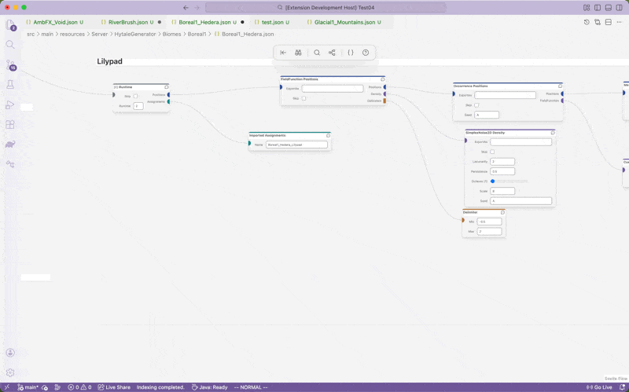
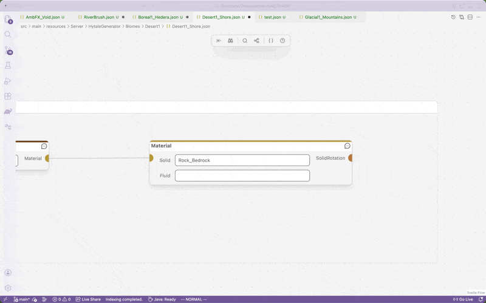
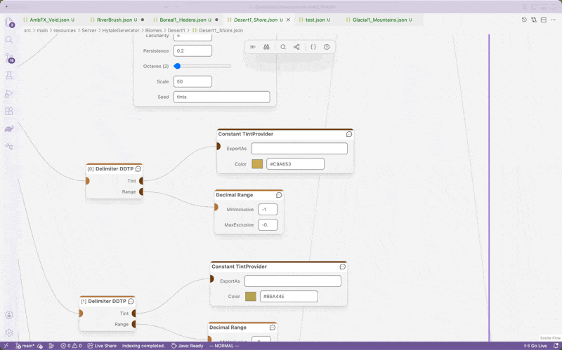
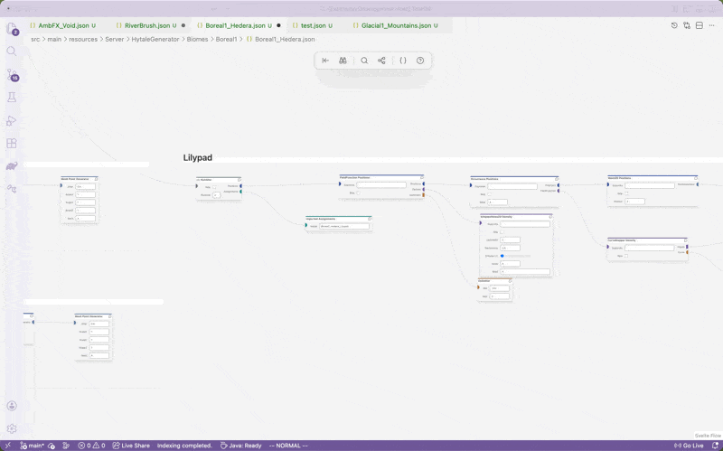
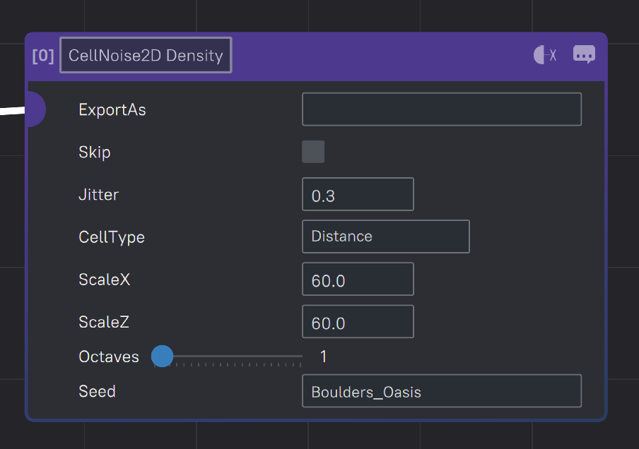
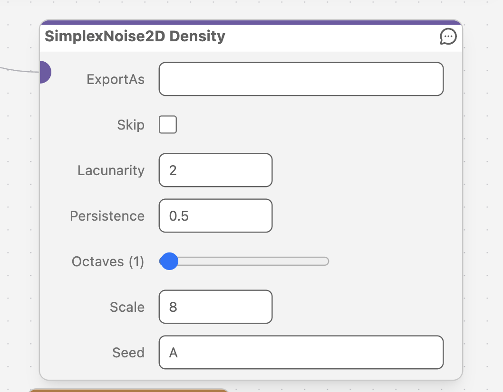
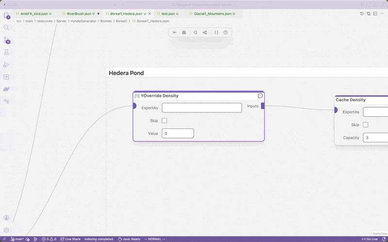
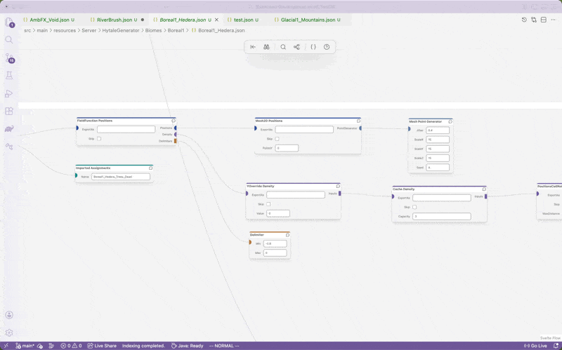
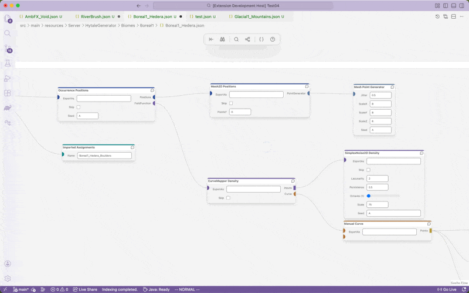

# Hytale Devtools

## Instantly Create New Mods

Instantly create new fully-configured mods using the "Create New Hytale Mod" command.

## Easily Copy/Create Any Asset

Easily create new assets in their respective folders, override existing assets, or copy existing assets as templates.

## Built-in WorldGen V2 Node Editor

This extension includes a custom node editor for modifying World Generation + Scriptable Brush files, including several improvements and new features over the original.

### Fully Cross-Platform

Mac + Windows users can now participate in Worldgen development with full cross-platform support!

### Autocomplete, Documentation Tooltips, and Color Picker

Autocompletion values are generated based on the Server code itself, and are updated automatically by using a light-weight companion mod built into the extension, automatically set up to be included when you run your mod's server in VSCode.

### Optimized Control Schemes for Mouse AND Trackpad

Clicking and dragging to move through the workspace can get tedious on a trackpad, so I added a Trackpad-specific control scheme that allows you to freely scroll through the workspace and pinch to zoom!

### Styling Updates

Field alignments and node sizes are now more compact and aligned to be more readable.

### Works with any color theme

### Customizable Keybinds

Keybindable actions such as searching and auto-layout can be fully customized.

### Improved search + Keyboard-only control

- Search for a field to automatically focus it for keyboard editing - no mouse required.
- Searched nodes are sorted by distance, so you can quickly jump to any node you see by typing.
- Scrolling through the search selections will preview them in real-time, and cancelling the search will return you to your original position.

### Always-Visible Group Titles

Managing large workspaces becomes easy when organizing with groups. No matter how far you zoom out, you can tell which groups are which without them blocking your vision close-up.

## Future Planned Features

- Custom key-value editor similar to the base game's asset editor to show and edit the full list of available properties and inherited values of an asset.
- Custom NPC editor

## Attribution
- The base template used for creating new mods is based on Build-9's [Hytale Example Project](https://github.com/Build-9/Hytale-Example-Project).
